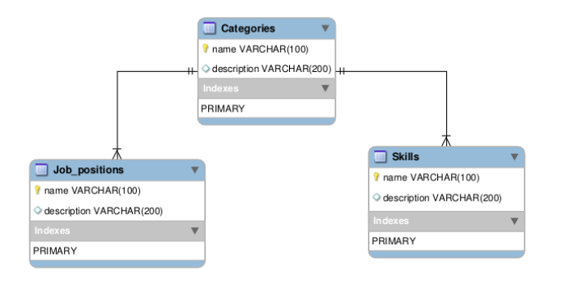

Objetivo
===============

Documentar información técnica del *Shared Server* para poder ejecutar, extender y mejorar dicho servidor.

Requisitos:
================

El servidor de la aplicación *Linkedun* al cuál se consultan todos los servicios está desarrollado en *NodeJS*, utiliza los siguientes módulos:

* **pg:** V6.1.0 “PostgreSQL” [2]
* **Express:** V4.13.3 “Framework de infraestructura web rápida, minimalista y flexible para las aplicaciones Node.js.”[3]
* **Winston:** V^2.3.0 “Logger”[4]
* **pg-promise:** V ^3.2.3 “Promises interface for PostgreSQL”[5]
* **bluebird:** V^3.3.4 “Promises in NodeJS”[6]
* **body-parser:** V ^1.15.2 “Node.js body parsing middleware”[7]
* **ejs:** V2.4.1 “Embedded JavaScript templates”[8]

Distribución
===============

El código puede ser descargado de la página oficial de *github [10]*.
Sistema operativo
El desarrollo de la aplicación se ha realizado bajo el sistema operativo Linux. De querer desarrollar en Windows o Mac, deberá considerar la portabilidad de todas las dependencias a esos sistemas operativos y cómo realizar la compilación del proyecto.

Construcción de Imágenes Docker (Builds)
=========================================

Este software está diseñado para ejecutarse en un contenedor Docker. Para ello, primero necesitamos construir la imagen de PostgreSQL para la base de datos que le da infraestructura a este servidor. 

Posicionarse dentro de la carpeta /database/ dentro de la carpeta principal del proyecto descargado por git. Luego ejecutar el siguiente comando:

* docker build -t sharedserver-database .

Esto generará la dockerizacion de la base de datos, luego hay que posicionarse en la carpeta principal ( taller2/SharedServerHeroku/ ) y ejecutar el siguiente comando:

* docker-compose up

Este comando dockerizara NodeJs y unirá las dos aplicaciones (PostgreSQL y NodeJs) quedando el servidor operativo. Para detener la ejecución del servidor ejecutar Control + C.

Ejecución
=====================

A traves del comando:

* docker-compose up

Ejecutado en la carpeta principal, luego de haber realizado el instructivo de construcción, deberá dejar la aplicación de NodeJS escuchando en el puerto 5000 del servidor localhost. Asi como tambien la base de datos escuchando en el puerto 5432 del servidor localhost. Listas para ser utilizadas, exponiendo una web de administración descrita en el Manual del Administrador Shared.

Estructura
=======================
Las consultas a este servidor están expuestas en el index.js en el directorio raíz del proyecto y son realizadas a través la API [1], resumidamente posee los siguientes servicios:

.. code-block:: html

	app.get('/job_positions',db.getAllJobPositions);
	app.get('/job_positions/categories/:name',db.getAllJobPositionsByCategory);
	app.get('/categories',db.getAllCategories);
	app.get('/skills',db.getAllSkills);
	app.post('/skills/categories/:category',db.postskill);
	app.post('/job_positions/categories/:category',db.postJobPosition);
	app.post('/categories/',db.postCategory);
	app.put('/categories/:name',db.putCategory);
	app.put('/job_positions/categories/:category/:name',db.putJobPosition);
	app.put('/skills/categories/:category/:name',db.putSkill);
	app.delete('/job_positions/categories/:category/:name',db.deleteJobPosition);
	app.delete('/skills/categories/:category/:name',db.deleteSkill);
	app.delete('/categories/:name',db.deleteCategory);

Los cuales se encuentran implementados bajo los métodos que expone el módulo *queries.js*, donde se encuentran los accesos a la base de datos pertinentes en cada servicio. Todas las respuestas de dicho servicio son en formato JSON.
En cuanto a la web de administración esta se encuentra en el directorio *view/pages/* donde estan los archivos principales de la web y los controladores separados por skills, jobPosition y category.

Base de datos
===============================

Este servidor posee una base de datos *PostgreSQL* donde se almacenan los *jobPositions*, los *skills* y las *categories*. La estructura de la misma puede ser representada a través del siguiente diagrama:

Para una mejor comprensión puede recurrir al archivo sharedserver.sql el cual contendrá la creación de las 3 tablas (category, job_position y skill) con sus respectivos atributos y claves.

Administracion web
====================

El Shared Server posee una web de administración online en la plataforma Heroku [9]. Esta provee de las acciones denominadas alta, baja, modificación y borrado de jobPositions, skills y  categories donde se puede ver este tema más detallado en el Manual del Administrador Shared. Dicha web se encuentra en la url : `<https://guarded-sands-84788.herokuapp.com/#/>`_
Cabe destacar que este dominio en Heroku posee las mismas características que el dominio local en el cual se trato en este documento.
API
El Shared Server respeta la API-REST[1] para la interacción con el App Server y posteriormente la aplicación Android.

Contacto
===================

Por cualquier inquietud, duda, consulta, usted puede enviar un email a la casilla de correos 
linkedunservices@gmail.com y se le responderá a la brevedad.
También puede contribuir al proyecto, reportar bugs, etc en la página de github del proyecto.

Referencias
====================
* [1] API Restful Shared Server : `<http://rebilly.github.io/ReDoc/?url=https://gist.githubusercontent.com/NickCis/d6a8132a228440c41889b4e0003efc3b/raw/jobify-shared-api.yaml>`_
* [2]pg : `<https://www.npmjs.com/package/pg>`_
* [3]Express : `<https://www.npmjs.com/package/express>`_
* [4]Winston : `<https://www.npmjs.com/package/winston>`_
* [5]pg-promise: `<https://www.npmjs.com/package/pg-promise>`_
* [6]bluebird : `<https://www.npmjs.com/package/bluebird>`_
* [7]body-parser: `<https://www.npmjs.com/package/body-parser>`_
* [8]ejs : `<https://www.npmjs.com/package/ejs>`_
* [9]Heroku : `<https://www.heroku.com/>`_
